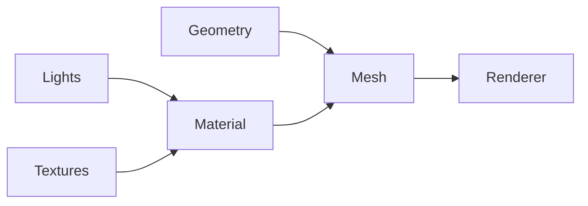
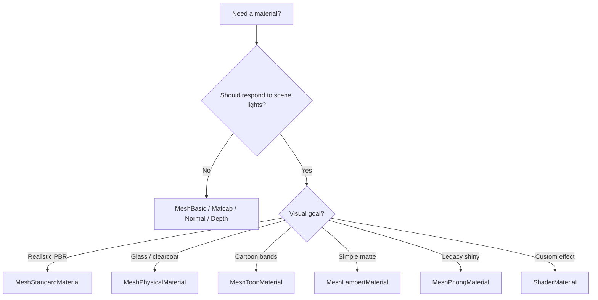

# Materials

> How Three.js turns geometry into visible surfaces — material choice drives lighting, performance, and the look of every mesh in the scene.

## How materials fit the pipeline

A **material** defines how a mesh reacts to light (or ignores it). Pair it with a **geometry** on a `Mesh`. The renderer runs the material's shader program each frame.



**Rule of thumb:** unlit materials (`MeshBasic`, `MeshNormal`, `MeshMatcap`, `MeshDepth`) ignore scene lights. Lit materials (`Lambert` → `Phong` → `Standard` → `Physical`) need at least one light (or an environment map) to look right.

## Unlit mesh materials

These render without calculating lighting. Fast and predictable — good for debug, UI overlays, skyboxes, and effects that shouldn't respond to scene lights.

### MeshBasicMaterial

Flat color or texture. No lighting math.

```javascript
const material = new THREE.MeshBasicMaterial({
  color: 'red',
  map: colorTexture,      // optional diffuse map
  wireframe: true,        // debug: show triangles
  transparent: true,
  opacity: 0.9,
  alphaMap: alphaTexture, // cutouts / transparency from grayscale map
  side: THREE.DoubleSide, // render back faces (planes, thin geometry)
});
```

| Use case | Why Basic |
|----------|-----------|
| Debug wireframes | `wireframe: true` shows topology instantly |
| Sprites, billboards, HUD | No lights needed; always visible |
| Textured quads (UI, video) | `map` only — no PBR setup |

**Quirks:** Ignores all lights — a white material stays white in a dark scene. Color textures should use `SRGBColorSpace`. For transparency, set `transparent: true` *and* often `alphaMap` or `opacity`. Single-sided by default — planes disappear from behind unless `side: THREE.DoubleSide`.

**In `animate.ts` (commented, ~L74–86):** explores `map: colorDoor`, toggling `color` / `wireframe`, mutating `material.color` via `THREE.Color('skyblue')`, `transparent`, `opacity`, `alphaMap: alphaDoor`, and `side: THREE.DoubleSide` — with an inline note that double-sided rendering *"needs more processing"* on planes.

**Elsewhere in repo:** `animate-basic.ts`, `animate-textures.ts`, `animate-square.ts`, `script.ts`; moon/glow/skull in `animate-pirate-sea.ts`; pulse rings in `animate-ai-eye.ts`.

### MeshNormalMaterial

Colors each pixel from the surface **normal** (direction the face points). RGB = XYZ.

```javascript
const material = new THREE.MeshNormalMaterial({
  side: THREE.DoubleSide,
  flatShading: true, // faceted look per triangle vs smooth per vertex
});
```

| Use case | Why Normal |
|----------|------------|
| Debug normals / shading | Instantly see if normals are flipped or broken |
| Stylized rainbow look | Pure aesthetic — no textures or lights |

**Quirks:** Not for production visuals. `flatShading` changes whether normals are per-face or interpolated — useful when debugging low-poly geometry.

**In `animate.ts` (commented, ~L88–91):** `side: THREE.DoubleSide`, `flatShading: true`.

### MeshMatcapMaterial

Fakes lighting with a **matcap** texture (a baked sphere lit from one angle). No scene lights required.

```javascript
const matcap = loader.load('matcap.png');
matcap.colorSpace = THREE.SRGBColorSpace;

const material = new THREE.MeshMatcapMaterial({
  matcap,
  side: THREE.DoubleSide,
});
```

| Use case | Why Matcap |
|----------|------------|
| Clay/sculpt preview | Looks 3D with zero lights |
| Mobile / perf-sensitive stylized objects | Cheaper than PBR |

**Quirks:** Lighting direction is **fixed** in the texture — doesn't match scene lights. Matcap must be loaded and color-space corrected (`matcap.colorSpace = THREE.SRGBColorSpace` in `animate.ts`).

**In `animate.ts` (commented, ~L93–95):** only sets `side: THREE.DoubleSide` — the `matcap` texture is loaded at L54 but not assigned in the commented block; you'd add `material.matcap = matcap` to see it. Comment: *"no light in the scene, creates illusion of light"*.

### MeshDepthMaterial

Renders **depth** (distance from camera) as grayscale. Near = dark, far = light (by default).

```javascript
const material = new THREE.MeshDepthMaterial({
  side: THREE.DoubleSide,
});
```

| Use case | Why Depth |
|----------|-----------|
| Depth passes / post-processing | SSAO, DOF, shadow techniques |
| Debug camera range | See what's inside near/far clip |

**Quirks:** Not meant for final color output. Often used as a render target, not displayed directly.

**In `animate.ts` (commented, ~L97–99):** `side: THREE.DoubleSide`.

---

## Lit mesh materials

These interact with lights. `animate.ts` always adds lights at L101–106 (`AmbientLight` intensity 1 + `PointLight` intensity 30 at `(2, 3, 4)`) — even when testing unlit materials above. Comment out the light block when comparing Matcap/Basic/Normal/Depth in isolation.

### MeshLambertMaterial

Classic **diffuse-only** model. Matte surfaces, no sharp specular highlights.

```javascript
const material = new THREE.MeshLambertMaterial({
  color: 0xffffff,
  side: THREE.DoubleSide,
});
// scene needs lights — animate.ts adds AmbientLight + PointLight
```

| Use case | Why Lambert |
|----------|-------------|
| Simple matte objects | Cheapest lit material |
| Legacy / educational | Shows diffuse lighting without specular complexity |

**Quirks:** Looks flat/plastic compared to Phong/Standard. No `roughness`/`metalness` — just `color` and optional `map`. Specular highlights don't exist.

**In `animate.ts` (commented, ~L108–110):** bare constructor + `side: THREE.DoubleSide`. Comment: *"requires lights"*.

### MeshPhongMaterial

Diffuse + **specular** highlights. Shininess controls highlight size.

```javascript
const material = new THREE.MeshPhongMaterial({
  color: 0xffffff,
  shininess: 100,                        // higher = tighter highlight
  specular: new THREE.Color('blue'),     // highlight tint
  side: THREE.DoubleSide,
});
```

| Use case | Why Phong |
|----------|-----------|
| Shiny plastic, wet look | Specular without full PBR |
| Older Three.js tutorials | Still valid; Standard is preferred now |

**Quirks:** `shininess` is non-physical — tuning is artistic, not energy-conserving. Superseded by `MeshStandardMaterial` for realistic work but cheaper than Physical.

**In `animate.ts` (commented, ~L112–115):** `shininess: 100`, `specular: new THREE.Color('blue')` — no `DoubleSide` in this block.

### MeshStandardMaterial

**PBR (physically based rendering)** with `roughness` and `metalness`. Default choice for realistic scenes.

```javascript
const material = new THREE.MeshStandardMaterial({
  color: '#6b4423',
  roughness: 0.75,   // 0 = mirror, 1 = fully rough
  metalness: 0.0,    // 0 = dielectric (wood), 1 = metal
  map: colorMap,
  normalMap,
  roughnessMap,
  metalnessMap,
  aoMap: ambientOcclusionMap,
  transparent: true,
  side: THREE.DoubleSide,
});
```

| Use case | Why Standard |
|----------|--------------|
| Realistic props, characters, environments | Industry-default PBR |
| Texture-driven surfaces (wood, metal, fabric) | Maps plug in directly |

**Quirks:** Needs lights *or* an environment map to look good — flat gray without either. Color maps → `SRGBColorSpace`; data maps (normal, roughness, metalness, AO) → `LinearSRGBColorSpace` or no color space. `aoMap` requires a second UV channel (`uv2`) on geometry unless using `aoMapIntensity` only.

**In `animate.ts` (active, ~L124–125):** bare `new THREE.MeshStandardMaterial()` — door textures are **loaded** (L58–63: alpha, color, metalness, ambient, roughness, normal) and `colorDoor` gets `SRGBColorSpace` (L67), but maps are **not yet assigned** to the material. `DoorHeight` is imported (L14) but not loaded — height/displacement is a future step. Wire maps like this:

```javascript
material.map = colorDoor;
material.normalMap = normalDoor;
material.roughnessMap = roughnessDoor;
material.metalnessMap = metalnessDoor;
material.aoMap = ambientDoor;
material.alphaMap = alphaDoor;
material.transparent = true;
```

**Elsewhere in repo:** Ship hull/wood/sails/coins in `animate-pirate-sea.ts`; graph nodes in `animate-ai-eye.ts`.

### MeshPhysicalMaterial

Extends Standard with **clearcoat**, **transmission** (glass), **sheen** (fabric), **ior**, etc.

```javascript
const material = new THREE.MeshPhysicalMaterial({
  color: 0xffffff,
  metalness: 0,
  roughness: 0,
  transmission: 1.0,   // glass-like
  thickness: 0.5,
  clearcoat: 1.0,      // car paint / lacquer layer
  clearcoatRoughness: 0.1,
});
```

| Use case | Why Physical |
|----------|--------------|
| Glass, water, gems | `transmission` + `thickness` |
| Car paint, lacquered wood | `clearcoat` |
| Velvet, cloth | `sheen` |

**Quirks:** Most expensive standard mesh material. Overkill for simple scenes — start with Standard and upgrade only when you need glass/clearcoat.

### MeshToonMaterial

Cel-shaded / cartoon look using a **gradient map** instead of smooth lighting falloff.

```javascript
gradient.minFilter = THREE.NearestFilter; // keep banding crisp
gradient.magFilter = THREE.NearestFilter;
const material = new THREE.MeshToonMaterial({
  gradientMap: gradient,
});
```

| Use case | Why Toon |
|----------|----------|
| Anime / comic style | Discrete shading bands |
| Stylized games | Cheap distinctive look |

**Quirks:** Gradient texture is often small — disable mipmapping (`NearestFilter`) or bands blur. Requires lights like other lit materials.

**In `animate.ts` (commented, ~L117–122):** uses `gradient3` (not `gradient5`), sets `gradient.minFilter` / `magFilter` to `NearestFilter`, then `material.gradientMap = gradient`. Comment: *"texture so small, we need to disable mipmapping"*.

---

## Custom shaders

### ShaderMaterial

Write GLSL with Three.js uniforms and chunks. Full control.

```javascript
const material = new THREE.ShaderMaterial({
  uniforms: { uTime: { value: 0 }, uColor: { value: new THREE.Color('#4488ff') } },
  vertexShader: `...`,
  fragmentShader: `...`,
});
```

| Use case | Why Shader |
|----------|------------|
| Procedural effects (water, holograms) | No built-in material fits |
| Full-scene post tweaks per object | Uniform-driven animation |

**Quirks:** You own lighting unless you import Three's shader chunks. Harder to maintain. **In this repo:** animated water plane in `animate-pirate-sea.ts`; AI eye core in `animate-ai-eye.ts`.

### RawShaderMaterial

Same as `ShaderMaterial` but **without** Three.js shader prefixes/helpers — pure GLSL.

**Quirks:** Use only when porting external shaders or you need zero Three injection. More boilerplate.

---

## Non-mesh materials

Used with `Points`, `Line`, or `Sprite` — not regular `Mesh` geometry.

| Material | Paired with | Setup | Use case |
|----------|-------------|-------|----------|
| `PointsMaterial` | `Points` | `{ color, size, transparent, opacity }` | Star fields, particles |
| `LineBasicMaterial` | `Line` / `LineSegments` | `{ color, linewidth*, opacity }` | Wire edges, graph links |
| `LineDashedMaterial` | `Line` | `{ color, dashSize, gapSize }` | Dashed paths — call `line.computeLineDistances()` |
| `SpriteMaterial` | `Sprite` | `{ map, transparent, color }` | Billboards always facing camera |

\* `linewidth` > 1 only works on some platforms (WebGL limitation).

**In this repo:** stars/coins particles (`PointsMaterial`), graph edges (`LineBasicMaterial`), labels (`SpriteMaterial`) in `animate-ai-eye.ts` and `animate-pirate-sea.ts`.

---

## Choosing a material (quick reference)



| Material | Lights? | Cost | Best for |
|----------|---------|------|----------|
| MeshBasic | No | Low | Debug, UI, unlit textures |
| MeshNormal | No | Low | Normal debug |
| MeshMatcap | No | Low–Med | Fake-lit stylized meshes |
| MeshDepth | No | Low | Depth buffer / effects |
| MeshLambert | Yes | Low | Matte diffuse |
| MeshPhong | Yes | Med | Specular highlights |
| MeshStandard | Yes | Med–High | Realistic default |
| MeshPhysical | Yes | High | Glass, clearcoat, advanced PBR |
| MeshToon | Yes | Med | Cel shading |
| ShaderMaterial | Varies | Varies | Custom GLSL |

---

## Portfolio reference: `animate.ts`

`src/components/ThreeJS/animate.ts` is a materials sandbox. **Uncomment exactly one `material` block** (L74–125), keep the rest commented, and refresh to compare.

| Order | Material | Lines | What the comments explore |
|-------|----------|-------|---------------------------|
| 1 | `MeshBasicMaterial` | 74–86 | `map`, `color`, `wireframe`, `transparent`, `opacity`, `alphaMap`, `DoubleSide` |
| 2 | `MeshNormalMaterial` | 88–91 | `DoubleSide`, `flatShading` |
| 3 | `MeshMatcapMaterial` | 93–95 | `DoubleSide` (+ assign loaded `matcap`) |
| 4 | `MeshDepthMaterial` | 97–99 | `DoubleSide` |
| — | Lights | 101–106 | `AmbientLight(1)` + `PointLight(30)` — comment out for unlit tests |
| 5 | `MeshLambertMaterial` | 108–110 | `DoubleSide` |
| 6 | `MeshPhongMaterial` | 112–115 | `shininess: 100`, `specular: blue` |
| 7 | `MeshToonMaterial` | 117–122 | `gradientMap` + `NearestFilter` on `gradient3` |
| 8 | `MeshStandardMaterial` | 124–125 | **currently active** — bare constructor; door maps loaded but unassigned |

**Shared meshes (L129–131):** one material instance on sphere `(0.5, 16, 16)`, plane `(1, 1)`, torus `(0.3, 0.2, 16, 32)` — rotation animated in the render loop so lighting and normals are easy to read.

## See also

- Textures and color space (door texture set loaded alongside materials in `animate.ts`) — future note: `Notes/three-js/textures.md`
- Lights — required for Lambert through Physical/Toon

## Summary

**Key takeaways**

- **Unlit** (`Basic`, `Normal`, `Matcap`, `Depth`) ignore scene lights; **lit** materials need lights and/or env maps.
- **MeshStandardMaterial** is the realistic default; **Physical** adds glass/clearcoat; **Toon** + gradient map for cel shading.
- Textures need correct **color space** (`SRGB` for color, linear for data maps).
- `side: THREE.DoubleSide`, `transparent`, and `alphaMap` solve most plane/cutout issues on Basic and Standard.
- Custom effects → **ShaderMaterial**; particles/lines/sprites use their own material classes.

**Conclusion**

Materials sit between geometry and the renderer: pick unlit for debug and UI, Standard for believable surfaces, Physical when you need transmission or clearcoat, and ShaderMaterial when nothing built-in fits. The commented blocks in `animate.ts` are the fastest way to feel each type side-by-side. Next logical sub-topic: **textures** (maps, UVs, and color space) since Standard/Physical quality depends heavily on texture setup.
