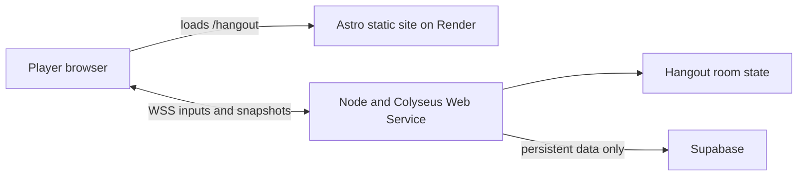

# Multiplayer Hangout Architecture

> Reference plan for adding a small, room-based Three.js multiplayer hangout to the existing Astro portfolio while running realtime gameplay on a separate service.

## Current decision

The game client should be a dedicated static page within the existing Astro portfolio. The realtime server should live in the same Git repository under `server/`, but Render should deploy it as an independent Web Service.

The initial stack is:

- Astro page containing a native Three.js client
- Vite/TypeScript through Astro's existing build system
- Node.js and TypeScript on the server
- Colyseus for rooms, synchronized state, and reconnection
- WebSockets for realtime communication
- Supabase only for durable data such as accounts, profiles, or saved customization
- Render Static Site for the portfolio and Render Web Service for the multiplayer server

React and React Three Fiber are not required. Ordinary HTML and CSS can handle the lobby, chat, menus, and HUD.

## System architecture



The browser owns rendering, animation, audio, input collection, interpolation, and presentation UI. The room server owns membership and the canonical shared state. Supabase must not be used as the high-frequency movement transport.

## Proposed repository layout

```text
AramisJonesPortfolio/
├─ src/
│  ├─ pages/
│  │  └─ hangout.astro
│  └─ game/
│     ├─ main.ts
│     ├─ Game.ts
│     ├─ World.ts
│     ├─ Player.ts
│     ├─ NetworkPlayers.ts
│     ├─ networking/
│     │  └─ GameClient.ts
│     └─ ui/
│        ├─ lobby.ts
│        ├─ chat.ts
│        └─ hud.ts
├─ server/
│  ├─ src/
│  │  ├─ index.ts
│  │  ├─ rooms/
│  │  │  └─ HangoutRoom.ts
│  │  └─ state/
│  │     └─ HangoutState.ts
│  ├─ package.json
│  └─ tsconfig.json
└─ package.json
```

Keep the game bundle local to `/hangout` so visitors to other portfolio pages do not download Three.js game assets unnecessarily. The server can begin with colocated client/server message types; introduce a shared protocol package once the message surface grows enough to justify it.

## Render deployment

Create two Render resources pointing to the same repository.

| Resource | Root | Responsibility |
|---|---|---|
| Static Site | Repository root | Build and publish the Astro portfolio, including `/hangout` |
| Web Service | `server/` | Run the Node/Colyseus process and accept WebSocket connections |

The client should read the production server address from a public build variable such as `PUBLIC_GAME_SERVER_URL`. Production connections must use `wss://`. The server should bind to `0.0.0.0` and the port supplied by Render.

If the selected Render service sleeps when idle, the client needs an explicit connecting or waking-server screen and automatic reconnection. Deployments and infrastructure maintenance can also interrupt live WebSockets, so reconnection is required even on an always-on instance.

## Room responsibilities

`HangoutRoom` should initially own:

- Creating, joining, leaving, and disposing rooms
- Player identifiers, display names, and avatar configuration
- Canonical player transforms or validated movement inputs
- Chat, emotes, and lightweight interactions
- Shared object state
- Reconnection and removal of stale players
- Periodic snapshots sent to connected clients

The client should send actions or inputs rather than trusting a player-provided final result. Remote transforms should be interpolated locally so the scene can render smoothly at 60 FPS while network snapshots arrive less frequently.

Suggested message categories:

```text
join
leave
input
snapshot
chat
emote
interaction
object-update
```

Do not send movement on every rendered frame. Begin with approximately 10–15 network updates per second, measure the result, and adjust based on the actual movement model and server capacity.

## Client implementation boundaries

Native Three.js should own the renderer, scene, camera, game loop, physics integration, entities, and cleanup. Avoid placing per-frame values into a UI framework's state.

The Astro page should provide the canvas and DOM interface, then load a client-side TypeScript entry module. Plain DOM modules are sufficient for the first lobby and HUD. React could be introduced later for a large application-style interface, but it should remain an overlay around an independently managed `Game` instance.

## Security and persistence

- Never expose a Supabase secret or `service_role` key in the browser.
- Restrict allowed browser origins on the WebSocket service to the portfolio's production origin and approved development origins.
- Validate message type, size, shape, rate, and authorization on the server.
- Keep transient transforms and presence in room memory rather than Postgres.
- Use Supabase for durable profiles, avatar selections, ownership, moderation records, or saved world data only when those features are introduced.
- Treat reconnects, duplicate messages, malformed payloads, and clients disappearing without a clean leave event as normal network conditions.

## Options considered

| Option | Decision |
|---|---|
| Astro full-stack server | Not preferred; SSR provides little value to a canvas-heavy client and couples the website to the game process |
| Static Astro page plus Web Service | Selected; preserves CDN delivery and isolates realtime server lifecycle |
| React client | Not initially needed; native Three.js plus DOM UI is simpler |
| React Three Fiber | Explicitly not desired |
| Supabase Realtime for all movement | Viable for a tiny prototype, but its fan-out limits and lack of a custom authoritative loop make the existing service a better fit |
| Player-hosted WebRTC | Lightweight but creates host migration, NAT traversal, trust, and reconnection complications |
| Raw WebSocket server | Possible, but Colyseus avoids rebuilding rooms, state synchronization, and reconnection infrastructure |

## Next implementation session

Another agent should begin by confirming the desired hangout behavior: maximum room size, movement style, chat requirements, persistence, authentication, and whether voice is in the first release. It can then scaffold `server/`, create a minimal `HangoutRoom`, add `/hangout`, and prove one complete vertical slice: two browser tabs join the same room and see each other's smoothly interpolated placeholder avatars.

The first milestone is networking correctness, not finished art or physics. Once join, leave, reconnect, input, and interpolation work reliably, avatar customization, shared objects, Supabase persistence, and richer social features can be added incrementally.

## Summary

**Key takeaways**

- Host the Three.js client as a route in the existing static Astro portfolio.
- Deploy a Node/Colyseus server separately from the same repository.
- Keep realtime room state on the server and durable account data in Supabase.
- Use native Three.js and plain DOM UI initially; React is optional rather than foundational.
- Validate inputs, send snapshots at a measured rate, and interpolate remote movement locally.

**Conclusion**

This structure keeps the hangout lightweight while leaving a clean path toward authoritative gameplay and persistent social features. The next useful step is a two-client vertical slice that verifies room lifecycle and movement synchronization before expanding the game.
